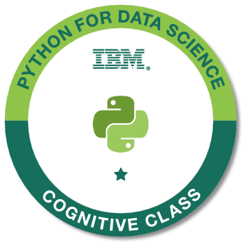
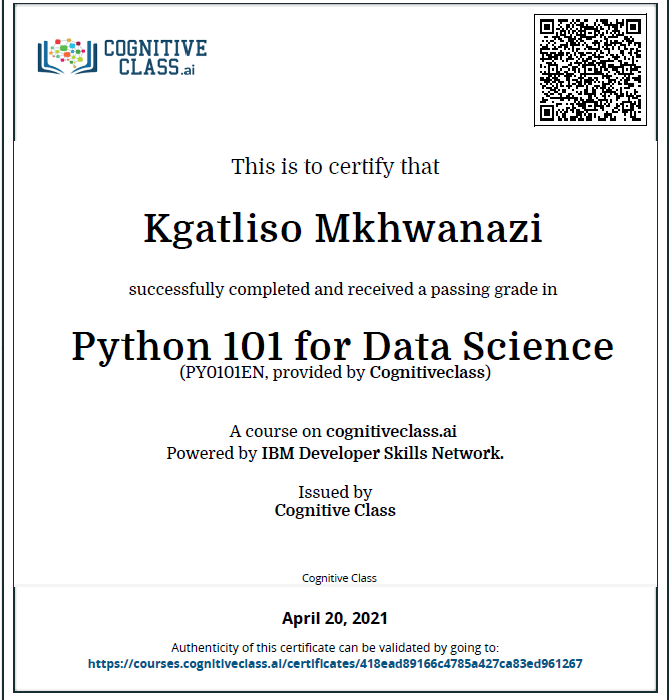

# Python-for-Data-Science

___This is a repository that tracks my progress in the IBM Cognative class course namely, Python for Data Science.___

___I have passed the IBM cognitive class with a mark of 98% to receive my certificate and badge which you can see below.___
IBM badge                          |  IBM certificate
:---------------------------------:|:-------------------------:
   | 
  

___Below are the links to my GitHub Gist and IBM Watson Studio which shows what I've learnt in the IBM Cognative class course.___

        
Links 

        
 First Python Code on this course : https://gist.github.com/9d3a004471cd95c9a3eb55ceec929be4 

        
 String Operations                : https://gist.github.com/869aaab10e4e219b6df9a45feb96f5e0 

        
 Tuples in Python                 : https://gist.github.com/6945618144def2b5426f95f035b10dc0 

        
 Lists in Python                  : https://gist.github.com/67f2cef4e5abf20fbc52435b990fa6c8 

        
 Sets in Python                   : https://gist.github.com/5ea1b19ae139068cdd62df25ea43acb0 

        
 Dictionaries in Python           : https://gist.github.com/c7685bbb700afda0fae0701812ec09fd 

        
 Loops in Python                  : https://gist.github.com/d217c2582243198085d323e2c2e7809e 

        
 Functions in Python              : https://gist.github.com/e6cdf765bf95b5c50c0dc1017a318196 

        
 Exception Handling in Python     : https://gist.github.com/f1c3b22f09c4f7911c17df382293734a 

        
 Classes and Objects in Python    : https://gist.github.com/c4960a698b41b8979d91c5164ce923d3 

        
 Reading Files Python             : https://gist.github.com/b404960bc2c0de3af2eb9af5394ce9bf 

        
 Write and Save files in Python   : https://gist.github.com/908c8725346b76aec8c05e422fed5418 

        
 Introduction to Pandas in Python : https://dataplatform.cloud.ibm.com/analytics/notebooks/v2/81177609-0e93-4d33-ad83-f805ecca2027/view?access_token=914c09b5e1857f90d6b33f426557526eb6447dc4aca1da8ffa29c7c507c985ca 

        
 HTTP and Requests                : https://gist.github.com/9de399f9bcfa8606ca64106ada93a656 

     

